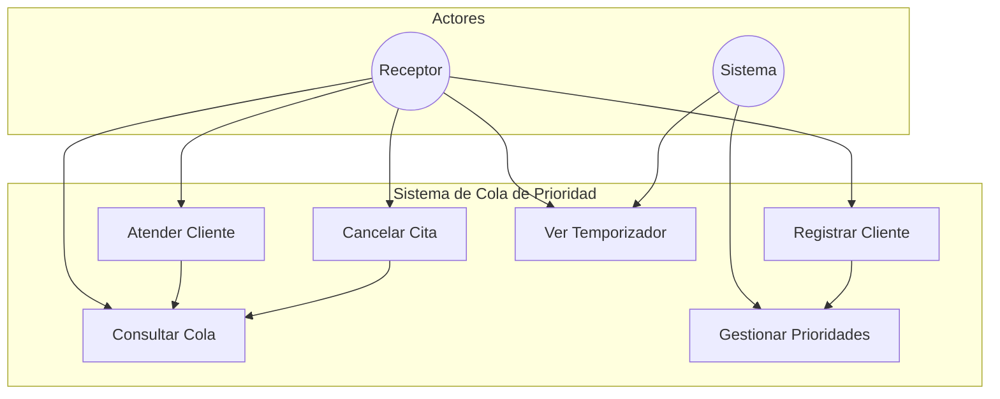

# Diagrama de Casos de Uso - Sistema de Cola de Prioridad

## Diagrama de Casos de Uso

## Descripción de Casos de Uso

### 1. Registrar Cliente
- **Actor**: Receptor
- **Descripción**: Permite registrar un nuevo cliente en el sistema
- **Precondiciones**: 
  * El sistema está operativo
  * El receptor tiene acceso al sistema
- **Flujo Principal**:
  1. El receptor ingresa los datos del cliente
  2. El sistema valida los datos
  3. El sistema asigna prioridad según tipo
  4. El sistema agrega el cliente a la cola
  5. El sistema actualiza la interfaz
- **Postcondiciones**:
  * El cliente queda registrado en el sistema
  * La cola se actualiza con el nuevo cliente
  * Se muestra confirmación al receptor

### 2. Atender Cliente
- **Actor**: Receptor
- **Descripción**: Permite atender al siguiente cliente en la cola
- **Precondiciones**:
  * Existe al menos un cliente en la cola
  * El sistema está operativo
- **Flujo Principal**:
  1. El receptor solicita atender siguiente cliente
  2. El sistema identifica el cliente con mayor prioridad
  3. El sistema retira el cliente de la cola
  4. El sistema actualiza la interfaz
- **Postcondiciones**:
  * El cliente es atendido
  * La cola se actualiza
  * Se muestra el siguiente cliente en espera

### 3. Cancelar Cita
- **Actor**: Receptor
- **Descripción**: Permite cancelar la cita de un cliente
- **Precondiciones**:
  * El cliente existe en el sistema
  * El sistema está operativo
- **Flujo Principal**:
  1. El receptor selecciona el cliente a cancelar
  2. El sistema verifica la existencia del cliente
  3. El sistema elimina al cliente de la cola
  4. El sistema actualiza la interfaz
- **Postcondiciones**:
  * El cliente es eliminado de la cola
  * La cola se actualiza
  * Se muestra confirmación de cancelación

### 4. Consultar Cola
- **Actor**: Receptor
- **Descripción**: Permite visualizar el estado actual de la cola
- **Precondiciones**:
  * El sistema está operativo
- **Flujo Principal**:
  1. El receptor solicita ver la cola
  2. El sistema muestra la lista de clientes
  3. El sistema muestra información de prioridades
- **Postcondiciones**:
  * Se muestra el estado actual de la cola
  * Se muestra información de clientes en espera

### 5. Gestionar Prioridades
- **Actor**: Sistema
- **Descripción**: Sistema automático de gestión de prioridades
- **Precondiciones**:
  * El sistema está operativo
- **Flujo Principal**:
  1. El sistema recibe nuevo cliente
  2. El sistema determina el tipo de cliente
  3. El sistema asigna prioridad correspondiente
  4. El sistema ordena la cola
- **Postcondiciones**:
  * La cola queda ordenada por prioridad
  * Se mantiene el orden de llegada para igual prioridad

### 6. Ver Temporizador
- **Actores**: Receptor, Sistema
- **Descripción**: Muestra el tiempo transcurrido
- **Precondiciones**:
  * El sistema está operativo
- **Flujo Principal**:
  1. El sistema inicia el temporizador
  2. El sistema actualiza el tiempo cada segundo
  3. El receptor puede ver el tiempo transcurrido
- **Postcondiciones**:
  * Se muestra el tiempo actual
  * El temporizador continúa actualizándose

## Relaciones entre Casos de Uso

### Dependencias
1. **Registrar Cliente → Gestionar Prioridades**
   - La gestión de prioridades se activa al registrar un cliente
   - Asegura el orden correcto en la cola

2. **Atender Cliente → Consultar Cola**
   - La consulta de cola se actualiza al atender un cliente
   - Mantiene la información actualizada

3. **Cancelar Cita → Consultar Cola**
   - La consulta de cola se actualiza al cancelar una cita
   - Refleja los cambios en tiempo real

## Notas de Implementación

### Consideraciones Técnicas
1. **Validaciones**:
   - Verificación de datos de entrada
   - Control de duplicados
   - Validación de tipos de cliente

2. **Actualizaciones**:
   - Interfaz en tiempo real
   - Ordenamiento automático
   - Gestión de memoria

3. **Seguridad**:
   - Control de acceso
   - Validación de operaciones
   - Protección de datos

### Mejoras Futuras
1. **Funcionalidades**:
   - Estadísticas de atención
   - Notificaciones automáticas
   - Historial de clientes

2. **Optimizaciones**:
   - Mejora en el ordenamiento
   - Caché de datos
   - Persistencia de información 