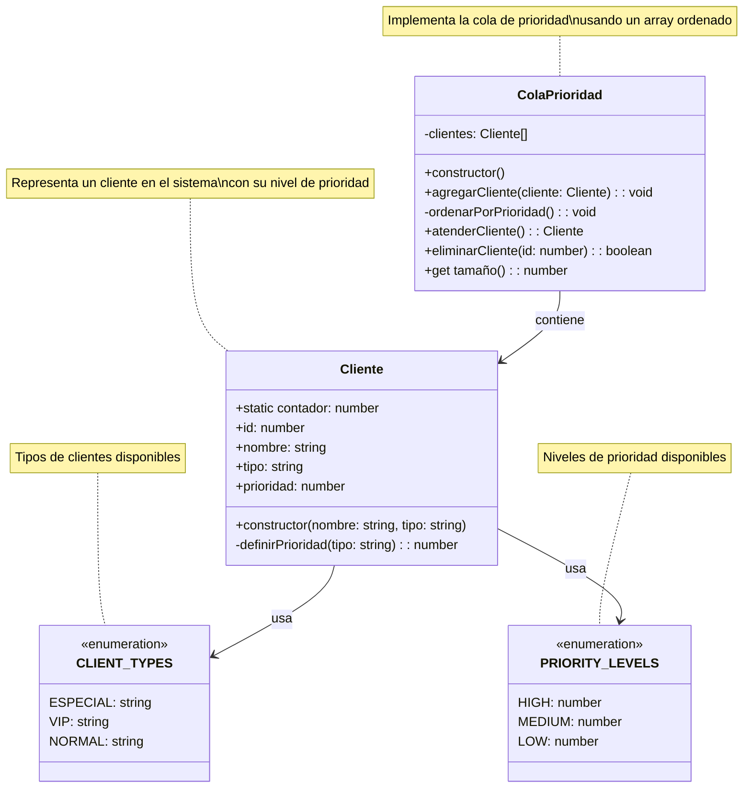

# Diagrama de Clases - Sistema de Cola de Prioridad

## Diagrama de Clases

## Descripción de las Clases

### Cliente
- **Atributos**:
  - `contador`: Contador estático para generar IDs únicos
  - `id`: Identificador único del cliente
  - `nombre`: Nombre del cliente
  - `tipo`: Tipo de cliente (especial, vip, normal)
  - `prioridad`: Nivel de prioridad (1: alta, 2: media, 3: baja)

- **Métodos**:
  - `constructor(nombre, tipo)`:
    * **Estructura**: Inicializa un nuevo nodo en la estructura de datos
    * **Validación**: Verifica la validez del nombre y tipo
    * **Complejidad**: O(1)
    * **Memoria**: O(1) - Crea un solo objeto
    * **Proceso**:
      1. Valida el nombre (no vacío, tipo string)
      2. Valida el tipo (debe ser un valor válido de CLIENT_TYPES)
      3. Genera ID único mediante contador estático
      4. Calcula y asigna la prioridad

  - `definirPrioridad(tipo)`:
    * **Estructura**: Función de mapeo tipo → prioridad
    * **Complejidad**: O(1)
    * **Memoria**: O(1)
    * **Proceso**:
      1. Utiliza switch case para mapear tipos a prioridades
      2. Retorna valor numérico según PRIORITY_LEVELS
      3. Implementa fallback a prioridad baja para tipos no reconocidos

### ColaPrioridad
- **Atributos**:
  - `clientes`: Array de clientes ordenado por prioridad
    * **Estructura**: Array dinámico
    * **Orden**: Mantenido por prioridad ascendente
    * **Acceso**: O(1) al primer elemento
    * **Memoria**: O(n) donde n es el número de clientes

- **Métodos**:
  - `constructor()`:
    * **Estructura**: Inicializa array vacío
    * **Complejidad**: O(1)
    * **Memoria**: O(1) - Solo crea referencia al array

  - `agregarCliente(cliente)`:
    * **Estructura**: Inserción en array ordenado
    * **Complejidad**: O(n log n) - Dominada por el ordenamiento
    * **Memoria**: O(1) - Solo agrega un elemento
    * **Proceso**:
      1. Valida que el cliente sea instancia válida
      2. Agrega al final del array
      3. Reordena el array completo
      4. Actualiza la interfaz

  - `ordenarPorPrioridad()`:
    * **Estructura**: Ordenamiento de array
    * **Algoritmo**: Sort nativo de JavaScript
    * **Complejidad**: O(n log n)
    * **Memoria**: O(1) - Ordenamiento in-place
    * **Proceso**:
      1. Utiliza función de comparación personalizada
      2. Ordena por prioridad ascendente
      3. Mantiene estabilidad del ordenamiento

  - `atenderCliente()`:
    * **Estructura**: Operación de cola (FIFO)
    * **Complejidad**: O(n) - Debido al desplazamiento del array
    * **Memoria**: O(1) - Solo retorna referencia
    * **Proceso**:
      1. Verifica si la cola está vacía
      2. Extrae el primer elemento (shift)
      3. Actualiza la interfaz
      4. Retorna el cliente atendido

  - `eliminarCliente(id)`:
    * **Estructura**: Filtrado de array
    * **Complejidad**: O(n) - Recorre todo el array
    * **Memoria**: O(n) - Crea nuevo array filtrado
    * **Proceso**:
      1. Filtra el array excluyendo el ID
      2. Verifica si hubo cambios
      3. Actualiza la interfaz
      4. Retorna resultado de la operación

  - `tamaño`:
    * **Estructura**: Getter de propiedad
    * **Complejidad**: O(1)
    * **Memoria**: O(1)
    * **Proceso**: Retorna length del array

### CLIENT_TYPES (Enumeración)
- **Valores**:
  - `ESPECIAL`: "especial"
  - `VIP`: "vip"
  - `NORMAL`: "normal"
- **Estructura**: Objeto constante
- **Uso**: Validación de tipos de cliente
- **Memoria**: O(1) - Referencia estática

### PRIORITY_LEVELS (Enumeración)
- **Valores**:
  - `HIGH`: 1 (Prioridad máxima)
  - `MEDIUM`: 2 (Prioridad media)
  - `LOW`: 3 (Prioridad baja)
- **Estructura**: Objeto constante
- **Uso**: Definición de niveles de prioridad
- **Memoria**: O(1) - Referencia estática

## Relaciones
1. `Cliente` utiliza `CLIENT_TYPES` para definir su tipo
2. `Cliente` utiliza `PRIORITY_LEVELS` para definir su prioridad
3. `ColaPrioridad` contiene una colección de objetos `Cliente`

## Notas de Implementación
- La cola mantiene los elementos ordenados por prioridad
- La prioridad más baja (1) tiene mayor precedencia
- Los IDs de clientes son únicos y autoincrementales
- La cola se reordena automáticamente en cada inserción

## Consideraciones de Rendimiento
1. **Inserción**: O(n log n) - Costo de ordenamiento
2. **Eliminación**: O(n) - Costo de filtrado/desplazamiento
3. **Búsqueda**: O(n) - Búsqueda lineal
4. **Acceso al frente**: O(1) - Acceso directo

## Optimizaciones Posibles
1. Implementar heap binario para O(log n) en inserción/eliminación
2. Usar estructura de datos más eficiente para búsqueda
3. Implementar caché para operaciones frecuentes
4. Considerar estructura de datos persistente para grandes volúmenes 