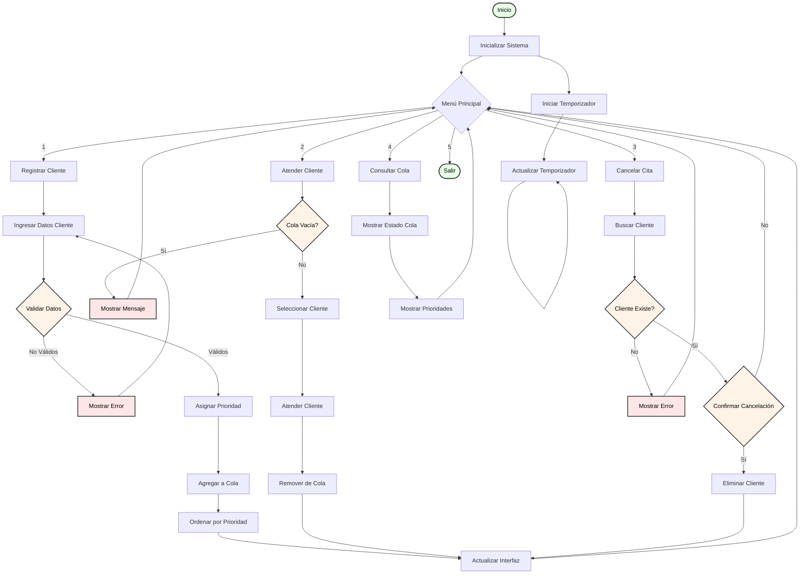

# Diagrama de Flujo - Sistema de Cola de Prioridad

## Diagrama de Flujo Principal

## Descripción de los Procesos

### 1. Inicialización del Sistema
- **Proceso**: `Inicializar Sistema`
  * Cargar configuración
  * Inicializar cola vacía
  * Configurar temporizador
  * Preparar interfaz de usuario

### 2. Registro de Cliente
- **Proceso**: `Registrar Cliente`
  * Entrada de datos
  * Validación de información
  * Asignación de prioridad
  * Inserción en cola
  * Ordenamiento
  * Actualización de interfaz

### 3. Atención de Cliente
- **Proceso**: `Atender Cliente`
  * Verificación de cola
  * Selección de cliente
  * Proceso de atención
  * Actualización de cola
  * Actualización de interfaz

### 4. Cancelación de Cita
- **Proceso**: `Cancelar Cita`
  * Búsqueda de cliente
  * Verificación de existencia
  * Confirmación de cancelación
  * Eliminación de cliente
  * Actualización de interfaz

### 5. Consulta de Cola
- **Proceso**: `Consultar Cola`
  * Visualización de estado
  * Mostrar prioridades
  * Actualización en tiempo real

### 6. Temporizador
- **Proceso**: `Gestionar Temporizador`
  * Inicialización
  * Actualización continua
  * Sincronización con interfaz

## Flujos de Error

### 1. Validación de Datos
- **Error**: Datos inválidos
  * Mostrar mensaje de error
  * Permitir corrección
  * Volver a validar

### 2. Cola Vacía
- **Error**: No hay clientes
  * Mostrar mensaje informativo
  * Volver al menú principal

### 3. Cliente No Encontrado
- **Error**: Cliente inexistente
  * Mostrar mensaje de error
  * Volver al menú principal

## Consideraciones de Implementación

### 1. Validaciones
- Verificación de datos de entrada
- Control de duplicados
- Validación de tipos de cliente

### 2. Actualizaciones
- Interfaz en tiempo real
- Ordenamiento automático
- Gestión de memoria

### 3. Temporizador
- Actualización cada segundo
- Sincronización con UI
- Gestión de recursos

### 4. Manejo de Errores
- Mensajes claros
- Recuperación de errores
- Logging de eventos

## Optimizaciones

### 1. Rendimiento
- Minimizar operaciones de ordenamiento
- Optimizar búsquedas
- Gestionar memoria eficientemente

### 2. Interfaz
- Actualizaciones eficientes
- Feedback inmediato
- Navegación intuitiva

### 3. Datos
- Validación proactiva
- Caché de datos frecuentes
- Persistencia eficiente 